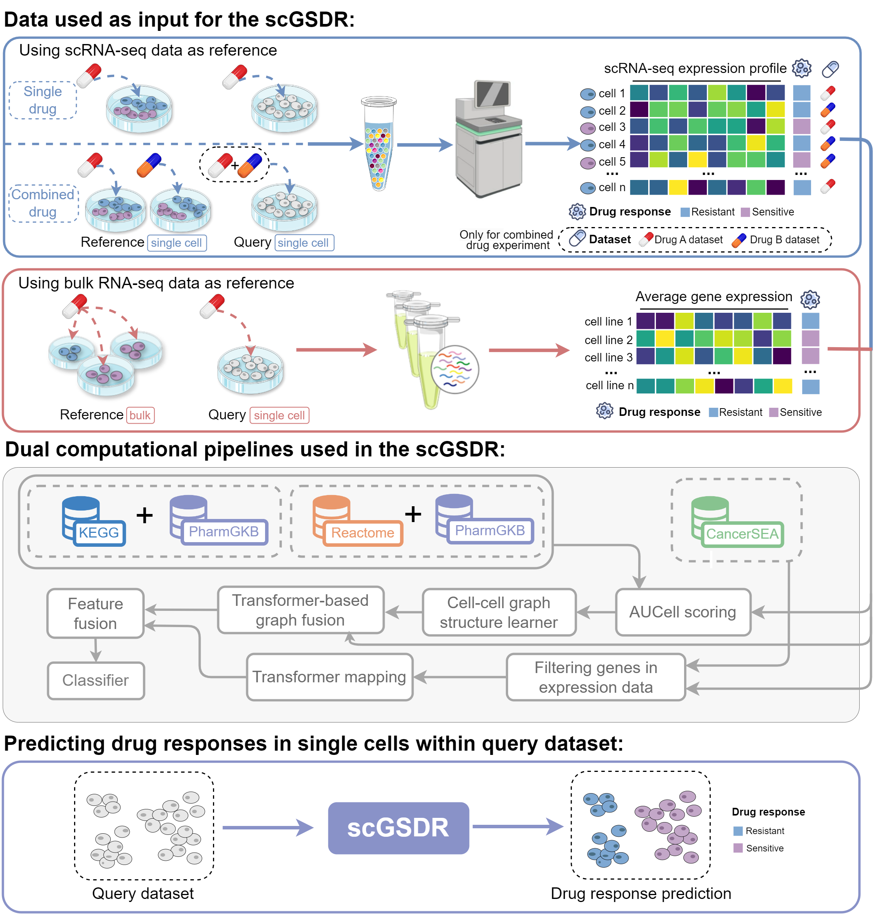

# scGSDR: Harnessing Gene Semantics for Single-Cell Pharmacological Profiling

We developed a method called scGSDR based on Python, which utilizes `torch` to learn the relationship between gene expression and drug response from either scRNA-seq or bulk RNA-seq data, and applies this knowledge to predict drug responses at scRNA-seq data. This project is a simple implementation of scGSDR.

## Requirements
### Python requirements
+ Python >= 3.9
+ torch >= 1.11.0
+ rpy2 >= 3.5.10

### R requirements
+ R >= 4.2.2
+ GSEABase >= 1.60.0
+ AUCell >= 1.20.2
+ SingleCellExperiment >= 1.20.1

## Usage
Run the model by executing the start_scGSDR.py file.

## Datasets
You can download the sample dataset and the pathway files required to run the model from Google Drive at the following link: https://drive.google.com/drive/folders/1cE-F02Kzjczsp1Dn-wDVy3RTfhbUoNCb?usp=drive_link

After downloading the files, place the data obtained from the cloud drive into the corresponding folders within the project's root directory.

